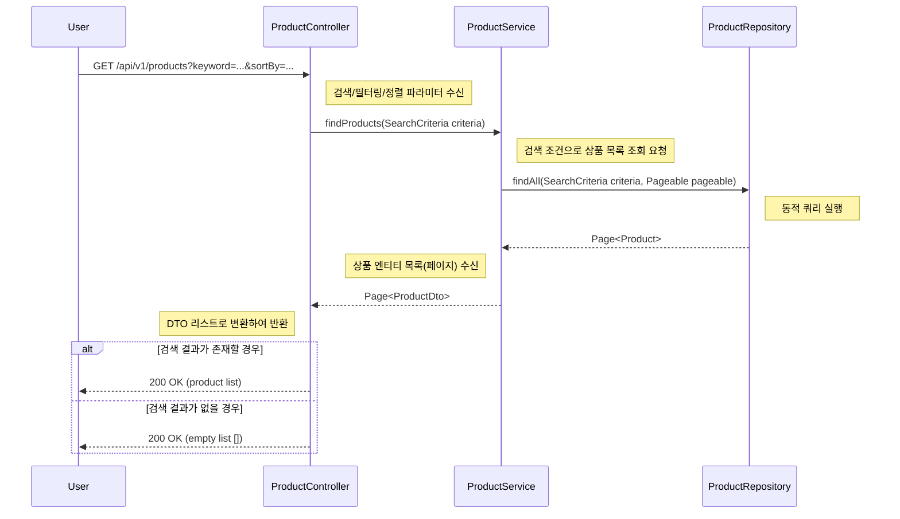
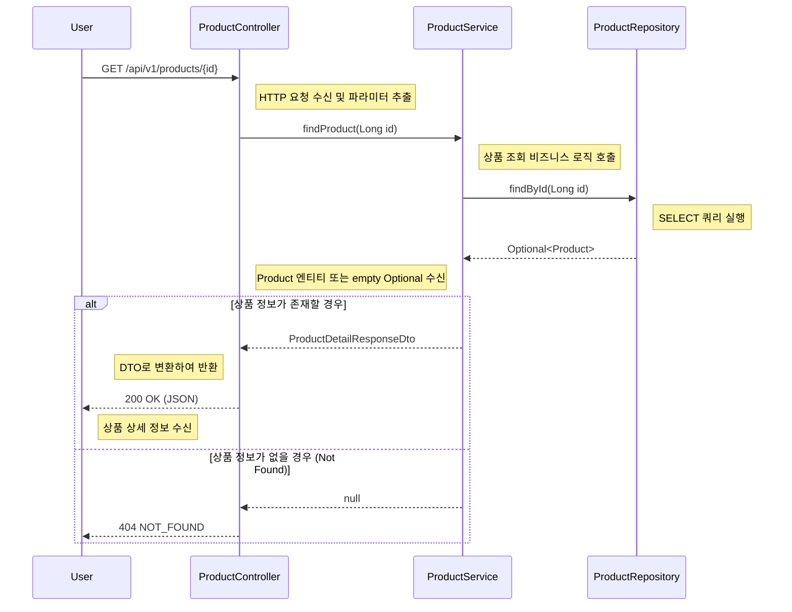
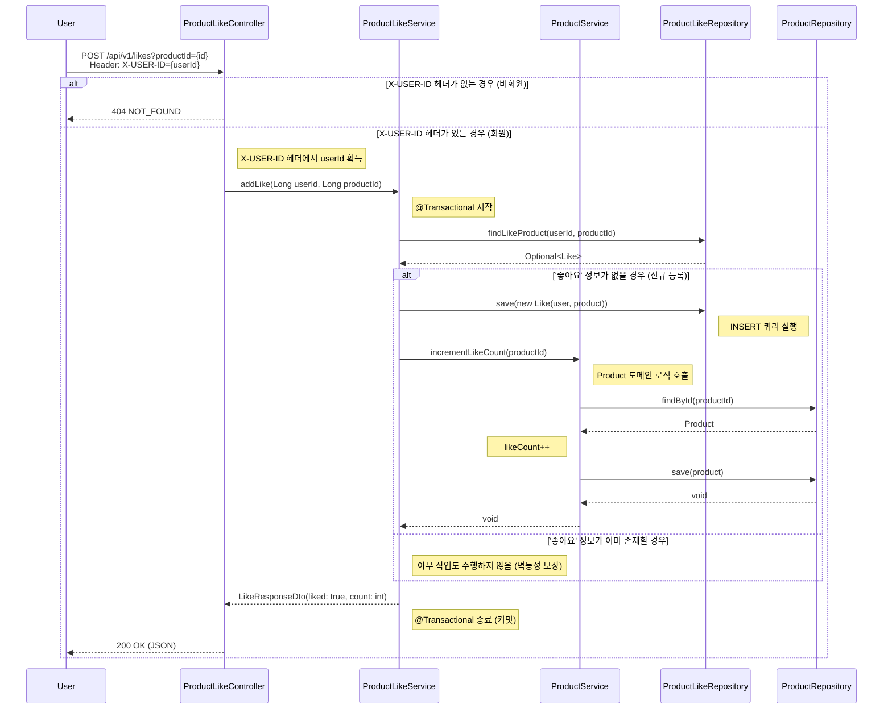
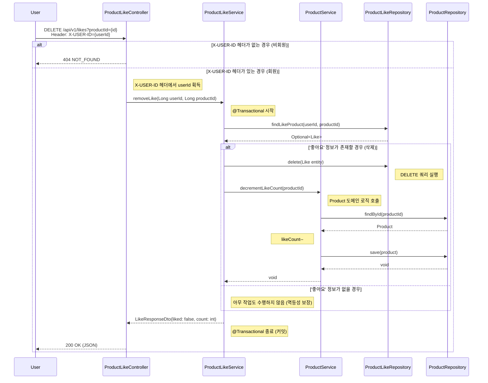
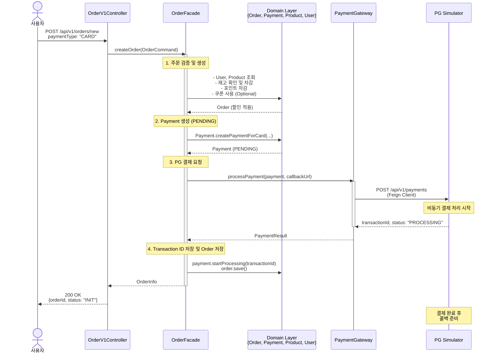
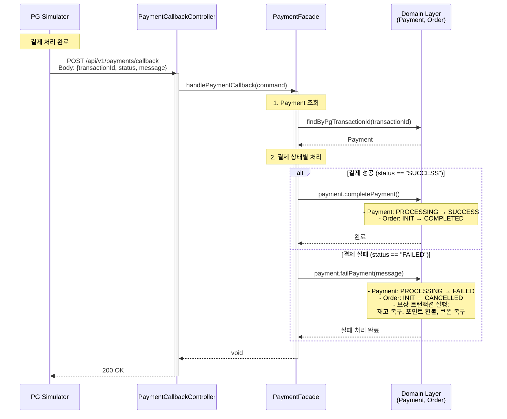
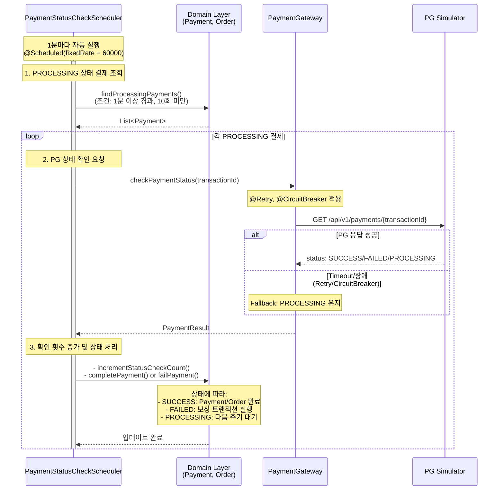

### E-Commerce 플랫폼 도메인 시퀀스 다이어그램

### 1. 상품 목록 조회

### 2. 상품 상세 정보 조회

### 3. 상품 '좋아요' 등록

### 4. 상품 '좋아요' 취소

### 5. 주문 생성 및 결제

## 6. 결제 콜백 처리 플로우

## 7. 스케줄러 기반 결제 상태 확인 플로우 (장애 복구)

콜백이 도착하지 않은 경우를 대비

