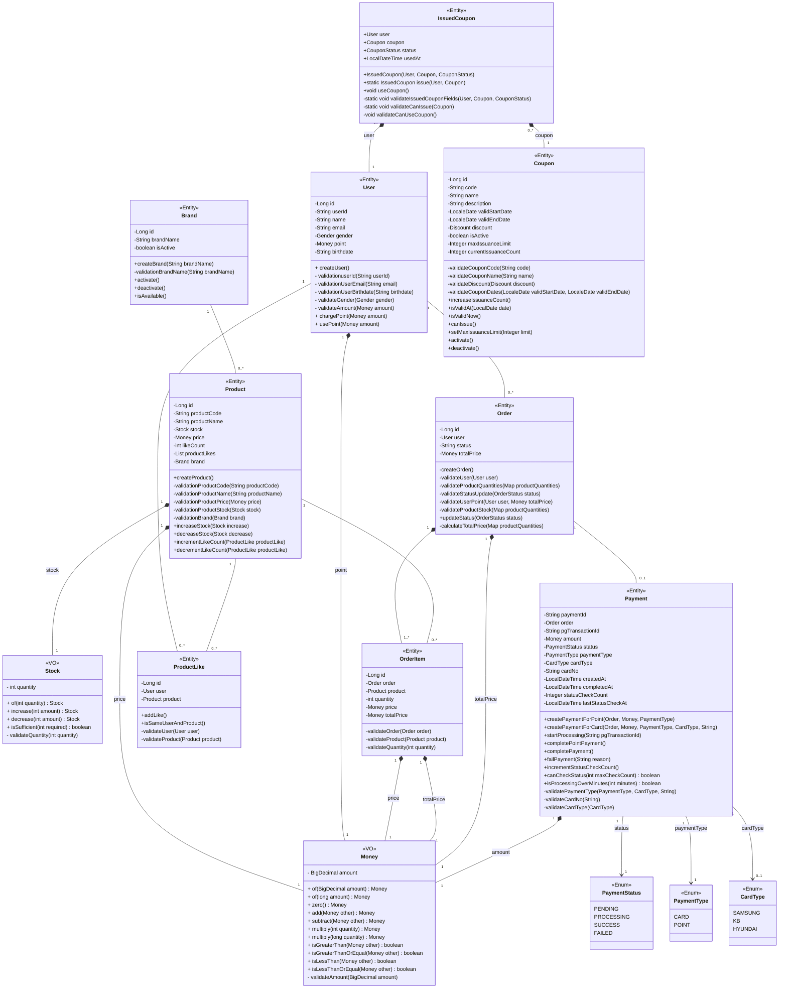

### E-Commerce 플랫폼 도메인 클래스 다이어그램

### 클래스 다이어그램 설명

*   **Product**: 상품의 기본 정보와 재고, 좋아요 수를 포함합니다.
*   **Brand**: 상품이 속한 브랜드 정보를 나타냅니다.
*   **User**: 시스템을 이용하는 사용자의 기본 정보와 포인트를 포함합니다.
*   **Order**: 사용자의 주문 정보를 나타냅니다.
*   **OrderItem**: 주문 내역에 포함된 개별 상품의 정보를 나타냅니다. `Order`와 `Product` 간의 N:M 관계를 해소하는 중간 엔티티 역할을 합니다.
*   **ProductLike**: 사용자가 특정 상품에 '좋아요'를 표시한 관계를 나타냅니다. `User`와 `Product` 간의 N:M 관계를 해소하는 중간 엔티티 역할을 합니다.
*   **Coupon**: 쿠폰 정보를 나타냅니다.
*   **IssuedCoupon**: 유저에게 발행된 쿠폰 정보를 나타냅니다.
*   **Payment**: 주문에 대한 결제 정보를 나타냅니다. PG사와의 연동을 통해 결제 처리 상태를 추적하며, 카드 결제와 포인트 결제를 지원합니다.
*   **PaymentStatus**: 결제의 상태를 나타내는 Enum입니다. PENDING(대기), PROCESSING(처리중), SUCCESS(성공), FAILED(실패) 상태를 가집니다.
*   **PaymentType**: 결제 수단을 나타내는 Enum입니다. CARD(카드 결제), POINT(포인트 결제)를 지원합니다.
*   **CardType**: 카드사 정보를 나타내는 Enum입니다. SAMSUNG, KB, HYUNDAI 카드를 지원합니다.