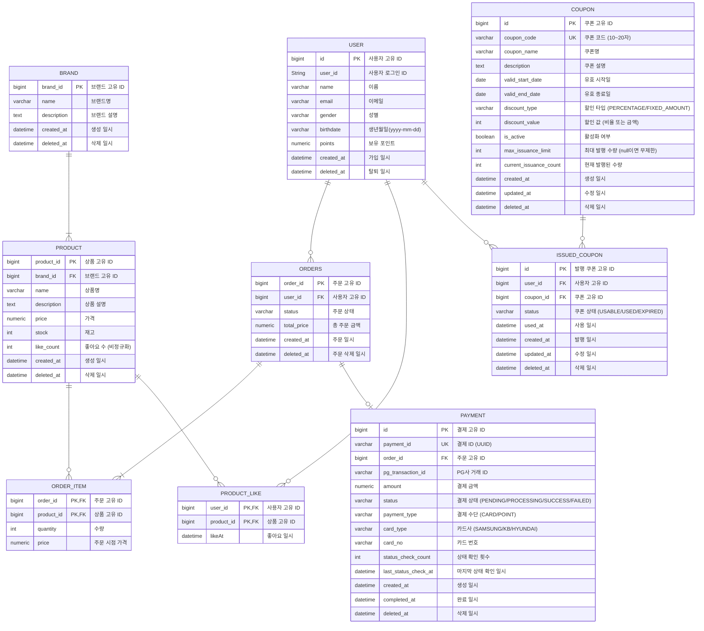

### E-Commerce 플랫폼 ERD

```mermaid
erDiagram
    USER {
        bigint id PK "사용자 고유 ID"
        String user_id "사용자 로그인 ID"
        varchar name "이름"
        varchar email "이메일"
        varchar gender "성별"
        varchar birthdate "생년월일(yyyy-mm-dd)"
        numeric points "보유 포인트"
        datetime created_at "가입 일시"
        datetime deleted_at "탈퇴 일시"
    }
    ORDERS {
        bigint order_id PK "주문 고유 ID"
        bigint user_id FK "사용자 고유 ID"
        varchar status "주문 상태"
        numeric total_price "총 주문 금액"
        datetime created_at "주문 일시"
        datetime deleted_at "주문 삭제 일시"
    }
    ORDER_ITEM {
        bigint order_id PK, FK "주문 고유 ID"
        bigint product_id PK, FK "상품 고유 ID"
        int quantity "수량"
        numeric price "주문 시점 가격"
    }
    PRODUCT {
        bigint product_id PK "상품 고유 ID"
        bigint brand_id FK "브랜드 고유 ID"
        varchar name "상품명"
        text description "상품 설명"
        numeric price "가격"
        int stock "재고"
        int like_count "좋아요 수 (비정규화)"
        datetime created_at "생성 일시"
        datetime deleted_at "삭제 일시"
    }
    PRODUCT_LIKE {
        bigint user_id PK, FK "사용자 고유 ID"
        bigint product_id PK, FK "상품 고유 ID"
        datetime likeAt "좋아요 일시"
    }
    BRAND {
        bigint brand_id PK "브랜드 고유 ID"
        varchar name "브랜드명"
        text description "브랜드 설명"
        datetime created_at "생성 일시"
        datetime deleted_at "삭제 일시"
    }

    COUPON {
        bigint id PK "쿠폰 고유 ID"
        varchar coupon_code UK "쿠폰 코드 (10~20자)"
        varchar coupon_name "쿠폰명"
        text description "쿠폰 설명"
        date valid_start_date "유효 시작일"
        date valid_end_date "유효 종료일"
        varchar discount_type "할인 타입 (PERCENTAGE/FIXED_AMOUNT)"
        int discount_value "할인 값 (비율 또는 금액)"
        boolean is_active "활성화 여부"
        int max_issuance_limit "최대 발행 수량 (null이면 무제한)"
        int current_issuance_count "현재 발행된 수량"
        datetime created_at "생성 일시"
        datetime updated_at "수정 일시"
        datetime deleted_at "삭제 일시"
    }

    ISSUED_COUPON {
        bigint id PK "발행 쿠폰 고유 ID"
        bigint user_id FK "사용자 고유 ID"
        bigint coupon_id FK "쿠폰 고유 ID"
        varchar status "쿠폰 상태 (USABLE/USED/EXPIRED)"
        datetime used_at "사용 일시"
        datetime created_at "발행 일시"
        datetime updated_at "수정 일시"
        datetime deleted_at "삭제 일시"
    }

    PAYMENT {
        bigint id PK "결제 고유 ID"
        varchar payment_id UK "결제 ID (UUID)"
        bigint order_id FK "주문 고유 ID"
        varchar pg_transaction_id "PG사 거래 ID"
        numeric amount "결제 금액"
        varchar status "결제 상태 (PENDING/PROCESSING/SUCCESS/FAILED)"
        varchar payment_type "결제 수단 (CARD/POINT)"
        varchar card_type "카드사 (SAMSUNG/KB/HYUNDAI)"
        varchar card_no "카드 번호"
        int status_check_count "상태 확인 횟수"
        datetime last_status_check_at "마지막 상태 확인 일시"
        datetime created_at "생성 일시"
        datetime completed_at "완료 일시"
        datetime deleted_at "삭제 일시"
    }

    USER ||--o{ ORDERS : ""
    USER ||--o{ PRODUCT_LIKE : ""

    PRODUCT ||--o{ ORDER_ITEM : ""
    PRODUCT ||--o{ PRODUCT_LIKE : ""

    ORDERS ||--|{ ORDER_ITEM : ""

    BRAND ||--|{ PRODUCT : ""

    USER ||--o{ ISSUED_COUPON : ""
    COUPON ||--o{ ISSUED_COUPON : ""
    ORDERS ||--o| PAYMENT : ""
```