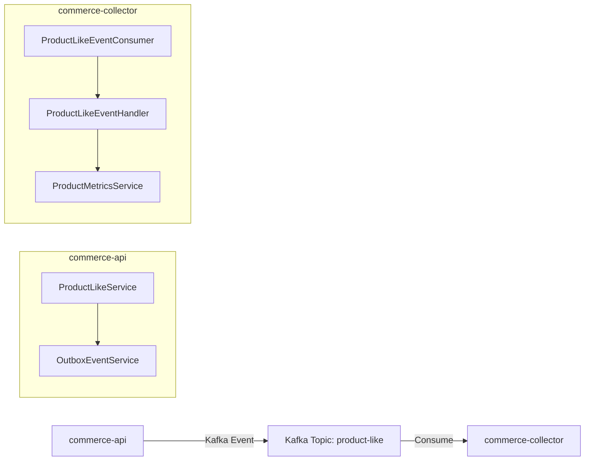
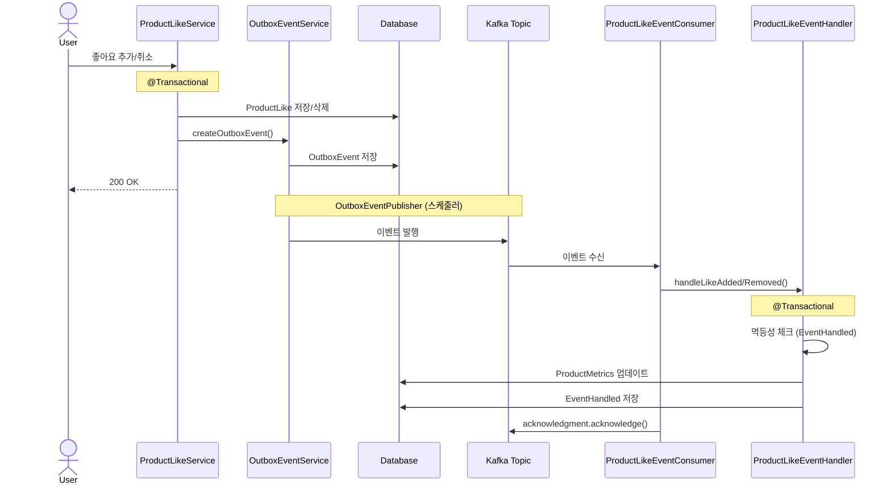

# Product Like Event Flow

상품 좋아요 이벤트 발행부터 집계 처리까지의 전체 플로우

## 전체 아키텍처

## 이벤트 플로우

## 핵심 설계 포인트

### 1. Outbox 패턴
DB 트랜잭션과 Kafka 이벤트 발행의 원자성 보장
- OutboxEvent를 DB에 저장 후 스케줄러가 Kafka로 발행
- 좋아요 저장과 이벤트 발행이 모두 성공하거나 모두 실패

### 2. 멱등성 보장
EventHandled 테이블로 중복 처리 방지
- Kafka 메시지 중복 수신 시에도 한 번만 처리
- At-Least-Once 전송에서도 Exactly-Once 처리 보장

### 3. 이벤트 발행 실패 시 로그만 기록
- 이벤트 발행 실패가 사용자 경험에 영향 주지 않도록
- 좋아요 기능의 가용성 향상
- Eventual Consistency 허용

### 4. 수동 커밋
- 이벤트 처리 완료 후에만 커밋
- 처리 실패 시 재처리 가능